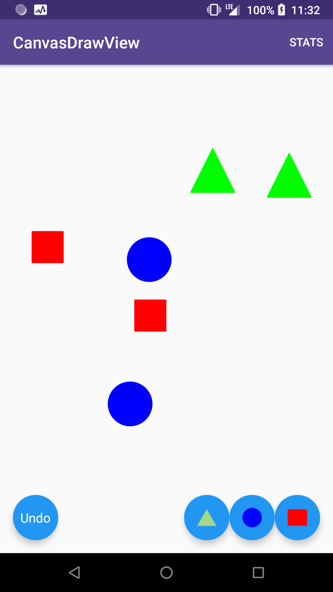

# 
 Android Project to Create 'Custom Canvas Draw View' and create shapes on canvas
================================================================================

Features Implemented:

1. Create a Custom View canvas.
2. Create Shapes like Circle, Triangle And Rectangle
3. Display buttons on screen, to add these shapes at random positions in screen.
4. Taping on a button will transform that shape to another shape.
5. User is able to UNDO action (creation and deletion) both
6. Long Press on a shape, will delete that shape
7. Deletion can be undone
8. Stats screen shows count of all shapes
9. Delete button to delete shapes of specific row in Canvas.

About UI
I have tried to create minimal UI, focussing more on code functionality , simplicity and architecture.

About Data Structures
Used 'LinkedList' of Shape objects to suit the required functionalities and minimize time and space complexity.

## Article Publication
A detailed article explaining canvas creation and custom drawing for this repo is [here](https://medium.com/@mayuri.k18/android-canvas-for-drawing-and-custom-views-e1a3e90d468b)

## Screenshots

## Built With

* [Android Studio](https://developer.android.com/studio/index.html) - The Official IDE for Android
* [Java] (https://www.oracle.com/technetwork/java/javase/overview/java8-2100321.html)
* [Kotlin](https://kotlinlang.org/) - The Official Language for Android
* [Gradle](https://gradle.org/) - Build tool for Android Studio

